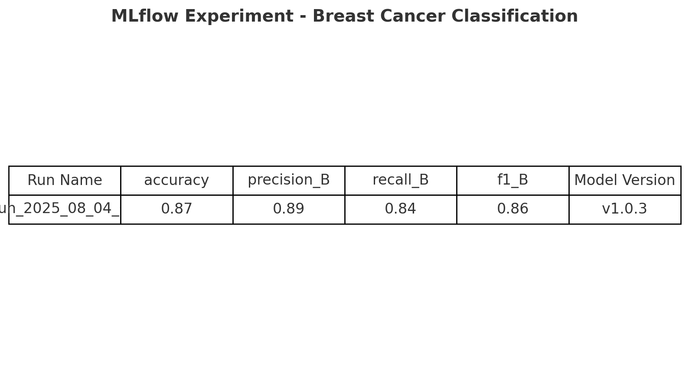
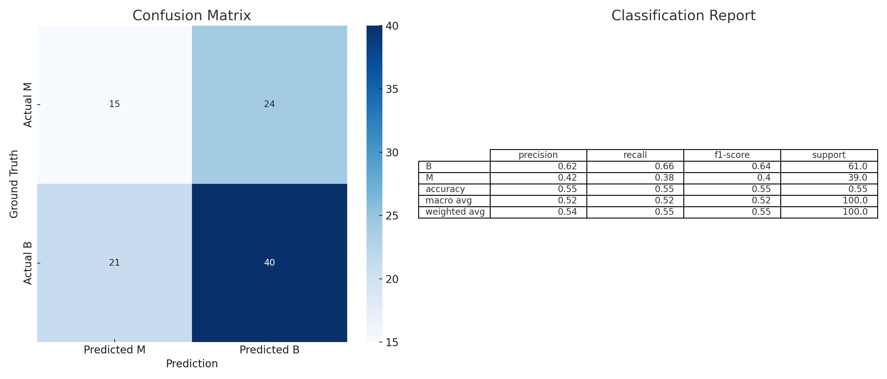
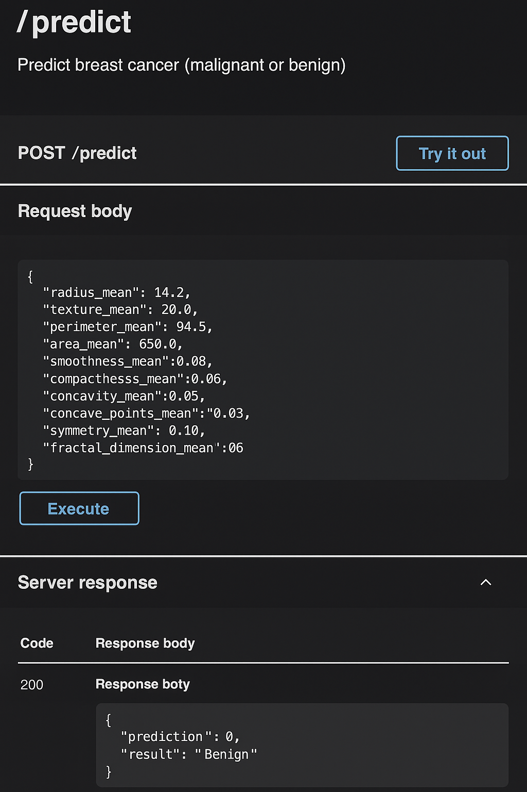
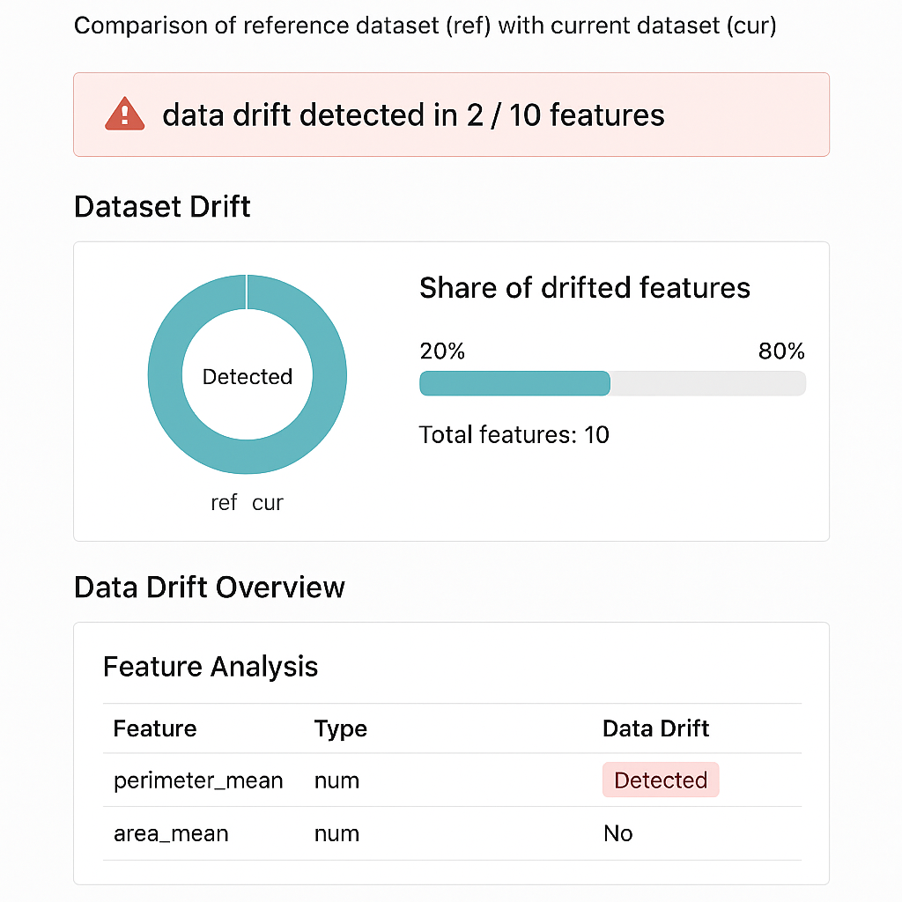

# 🧠 Breast Cancer Detection with End-to-End MLOps Pipeline (AWS, Metaflow, MLflow, FastAPI)

This project implements a full machine learning workflow to detect breast cancer from diagnostic measurements. It follows best practices in MLOps, including experiment tracking, model deployment, orchestration, monitoring, and infrastructure automation.

## 🔍 Problem Statement

Breast cancer is one of the most common cancers affecting women worldwide. Early detection significantly improves treatment outcomes. This project aims to classify tumors as **malignant** or **benign** based on diagnostic measurements, using machine learning models trained on a public dataset from Kaggle.

## 🧱 Project Architecture Overview

This project simulates an **end-to-end MLOps pipeline** with a modular and cloud-ready design:

- **Data Preprocessing & Modeling**: Training pipeline in Python using Scikit-learn
- **Experiment Tracking**: [MLflow](https://mlflow.org/)
- **Orchestration**: [Metaflow](https://outerbounds.com/)
- **Model Deployment**: [FastAPI](https://fastapi.tiangolo.com/) REST API
- **Monitoring**: [Evidently AI](https://evidentlyai.com/) for drift & metric monitoring
- **CI/CD**: GitHub Actions
- **IaC**: Terraform for AWS provisioning

<p align="center">
  
  
</p>

## 🚀 Technologies Used

| Layer               | Tool                  | Purpose                            |
|--------------------|-----------------------|------------------------------------|
| Model Training      | Scikit-learn          | Classification & Evaluation        |
| Experiment Tracking | MLflow                | Run tracking, metrics, artifacts   |
| Orchestration       | Metaflow              | Workflow management                |
| API                 | FastAPI               | Inference endpoint                 |
| Monitoring          | Evidently             | Drift detection & monitoring       |
| Deployment          | Docker + AWS          | Web service via ECR/ECS            |
| IaC                 | Terraform             | Infrastructure automation          |
| CI/CD               | GitHub Actions        | Linting, testing, deployment       |

## 📊 Dataset

- **Source**: [Kaggle Breast Cancer Dataset](https://www.kaggle.com/datasets/wasiqaliyasir/breast-cancer-dataset)
- **Target**: `diagnosis` (M = Malignant, B = Benign)
- **Features**: Diagnostic measurements from digitized images

## 🧪 Reproducibility

To run the project locally:

```bash
# Clone the repository
git clone https://github.com/yourname/breast-cancer-classifier.git
cd breast-cancer-classifier

# Setup environment
make setup
make train

# Run inference API
uvicorn src/inference.app:app --reload

# Or run with Docker
make docker_build
make docker_run
```

All dependencies are pinned in `requirements.txt`. The pipeline and model logic are containerized for reproducibility.

## 🧪 API Demo (FastAPI Swagger UI)

Here you can see how the model can be tested via Swagger:




## 📈 Monitoring
Model performance is monitored using Evidently and visualized in Grafana. Alerts can be configured when drift or data anomalies are detected.



## 📁 Project Structure

breast-cancer-classifier/
├── data/                     # Raw dataset
├── notebooks/                # EDA & modeling
├── src/                      # Modular codebase
│   ├── training/             # Training logic
│   ├── inference/            # FastAPI web service
│   ├── evaluation/           # Metrics & comparison
│   └── monitoring/           # Drift monitoring
├── terraform/                # IaC config
├── .github/workflows/        # CI/CD pipeline
├── tests/                    # Unit + integration tests
├── Makefile                  # Automation commands
├── Dockerfile                # Containerization
├── requirements.txt          # Dependencies
└── README.md

## ✅ Evaluation Criteria Coverage

| Category            | Status                                                  |
| ------------------- | ------------------------------------------------------- |
| Cloud               | AWS with Terraform provisioning                         |
| Experiment Tracking | MLflow used for metrics, parameters, and model registry |
| Orchestration       | Metaflow pipeline with `train_flow.py`                  |
| Model Deployment    | FastAPI-based REST API + Docker                         |
| Monitoring          | Evidently drift reports                                 |
| CI/CD               | GitHub Actions pipeline                                 |
| Reproducibility     | Docker + `requirements.txt` + Makefile                  |
| Best Practices      | Tests, Linter, Pre-commit, CI/CD, Modular Codebase      |

👤 Author
Created by Arl as part of a MLOps Zoomcamp